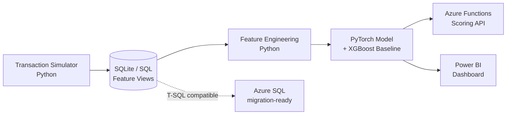

# Mobile Money Fraud Detection: End-to-End ML System

A complete fraud detection pipeline — from synthetic data generation through a deployed, cloud-hosted scoring API — built to demonstrate practical data science and MLOps skills across the full stack: SQL, PyTorch, Azure, and Power BI.

**[Live API](#deployment) · [Dashboard](#monitoring-dashboard) · [Results](#results)**

---

## The Problem

Fraud detection is a deceptively hard ML problem: fraud is rare (often <0.5% of transactions), the cost of a false negative and a false positive are wildly asymmetric, and naive accuracy metrics are useless (predicting "never fraud" scores 99.5%+ accuracy while catching nothing). This project builds a realistic, end-to-end system that confronts those problems directly rather than glossing over them.

Rather than using a pre-labeled Kaggle dataset, I built a **custom transaction simulator** modeling mobile money transfers (customers, merchants, and agents), with three distinct, realistic fraud typologies injected at a tunable, low rate:

- **Account takeover** — a dormant account suddenly drains most of its balance at odd hours
- **Smurfing** — a large sum broken into many small transfers to evade detection thresholds
- **Mule network** — money hopping rapidly through a chain of accounts before a final cash-out

## Architecture



**Stack:** Python (NumPy, pandas, scikit-learn) · SQL (SQLite, T-SQL-compatible) · PyTorch · Azure Functions · Power BI

## Key Technical Decisions

### 1. Leak-safe SQL feature engineering
All velocity and behavioral features (transaction counts in prior 1h/24h/7d, amount-to-historical-average ratio, time since last transaction) are computed with strict `<` timestamp comparisons and window functions that exclude the current row — no feature can see into its own future or its own value.

### 2. Catching a subtle data leakage risk before it mattered
Grouping fraud by "incident" (not row) revealed that smurfing and mule-network schemes each produce *multiple correlated transaction rows* from one underlying event. A naive random train/test split would let a model see part of a scheme during training and get evaluated on the rest — inflating apparent performance. The fix: an **incident-aware split**, verified to produce zero incidents spanning both train and test, using account identity for single-account fraud types and time-gap clustering for multi-account mule chains.

### 3. Class imbalance without synthetic-data risk
With ~0.33% fraud after tuning, I evaluated both `BCEWithLogitsLoss(pos_weight=...)` and SMOTENC (categorical-aware oversampling — plain SMOTE would generate nonsensical fractional one-hot values like "60% CASH_OUT / 40% TRANSFER"). The neural net used class weighting; SMOTENC was kept as a comparison path for the classical baseline.

### 4. Cost-based threshold selection, not arbitrary 0.5
The decision threshold was chosen by minimizing **total expected dollar cost** — treating a missed fraud as costing the full transaction amount, and a false alarm as a fixed review cost — rather than optimizing F1 or accuracy in the abstract. This produced a clean, interpretable U-shaped cost curve and a threshold (0.91) directly justified by business impact.

### 5. Debugging a real production deployment issue
Initial Azure Functions deployments succeeded but silently registered zero functions. Root cause: loading PyTorch and the model at *module import time* caused Azure's cold-start function indexing to time out before discovery completed. Fixed by lazy-loading the model on first request — a legitimate architectural pattern, not a workaround.

## Results

| Metric | Value |
|---|---|
| Test set PR-AUC | **0.837** |
| Precision @ cost-optimal threshold (0.91) | 40% |
| Recall @ cost-optimal threshold (0.91) | 88% |
| Expected cost reduction vs. naive 0.5 threshold | **83%** ($752 vs. $4,515) |
| vs. XGBoost baseline (same features, same split) | Neural net: $752 total cost · XGBoost: $1,741 total cost |

**By fraud type (recall):** mule_network 100% · smurfing 91% · account_takeover 62% — account takeover is hardest to catch, consistent with having the least behavioral context (a single isolated transaction vs. a multi-transaction burst).

All evaluation numbers come from a **fully held-out test set never used in training, validation, or threshold selection.**

## Deployment

The trained model is served via a serverless **Azure Functions** HTTP endpoint (`POST /api/score`), accepting a transaction's engineered features as JSON and returning a fraud probability and flagged decision. Chosen over an Azure ML managed endpoint specifically for cost reasons — a Consumption-plan Function has no idle cost, versus $70–140/month for an always-on managed endpoint, a deliberate tradeoff for a project at this scale.

```json
// Request
{"log_amount": 4.5, "txns_prior_1h": 0, "hour_sin": 0.5, ...}

// Response
{"fraud_probability": 0.998857, "flagged": true, "threshold_used": 0.91}
```

## Monitoring Dashboard

A 3-page Power BI dashboard covers:
- **Overview** — KPIs, fraud rate, and a fraud-vs-flagged trend line over the full simulation period
- **Model Performance** — the cost curve and precision/recall trade-off that justify the chosen threshold, plus a color-coded outcome matrix by fraud type
- **Transaction Explorer** — a sortable, filterable drill-down table (date, transaction type, account type slicers) for analyst-style investigation of flagged transactions

## Project Structure

```
├── fraud_simulator.py          # Custom transaction + fraud generator
├── build_database.py           # SQLite schema + load
├── feature_views.sql           # Leak-safe SQL feature engineering (T-SQL-compatible)
├── feature_engineering.py      # Python-side feature cleanup (sparse-history fix, encoding)
├── assign_incidents.py         # Groups correlated fraud rows into true incidents
├── train_test_split.py         # Incident-aware, leak-verified split
├── handle_imbalance.py         # pos_weight + SMOTENC comparison
├── train_model.py              # PyTorch FraudNet training
├── train_baseline.py           # XGBoost baseline for comparison
├── evaluate_model.py           # Cost-based threshold selection + final evaluation
├── prepare_powerbi_data.py     # Dashboard data exports
└── fraud_scoring/              # Azure Functions deployment
    ├── function_app.py
    ├── model_def.py
    |── fraud_modet.pt
    |── host.json
    |── requirements.txt
```

## What I'd Do Next

- Migrate from SQLite to Azure SQL Database (schema and queries are already T-SQL-compatible by design)
- Add Azure Data Factory for scheduled batch scoring rather than only on-demand API calls
- Expand the account-takeover fraud typology's feature set, since it's the current model's weakest point
